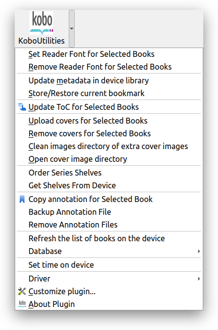
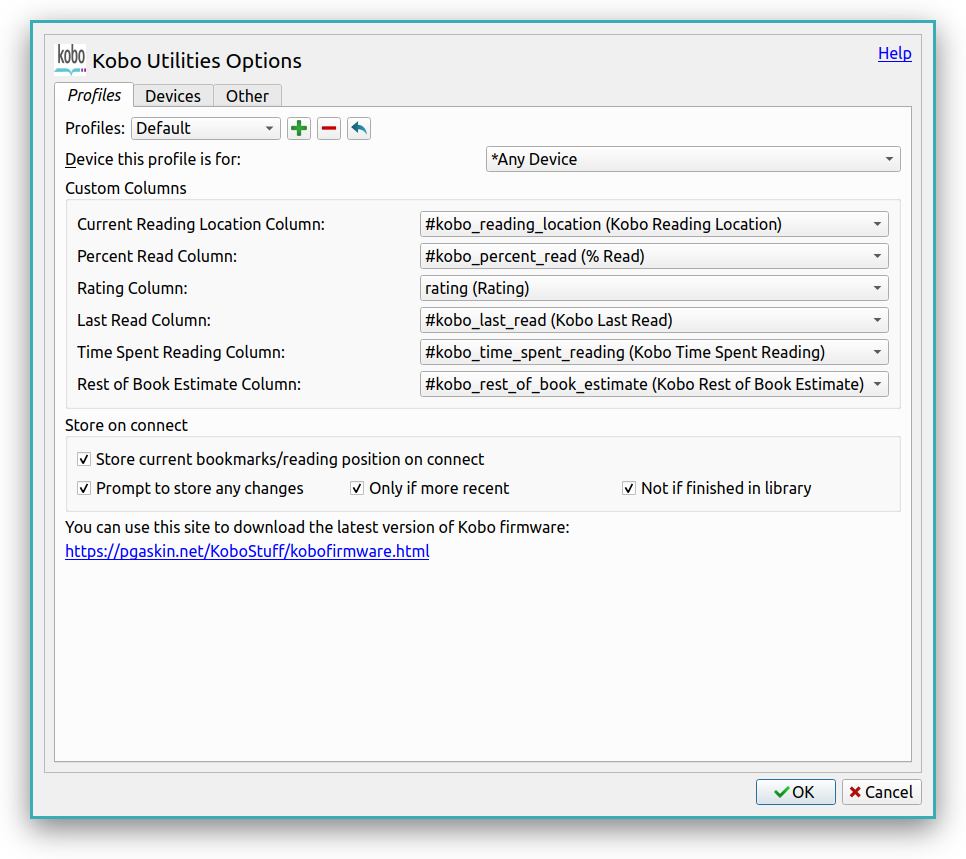

# Kobo Utilities

## Overview

This is a plugin for the [Calibre Ebook reader](https://calibre-ebook.com/)
that provides additional functionality when working with Kobo and newer Tolino (2024 onwards) eReaders.

It was originally written by [David Forrester](https://github.com/davidfor)
and is now maintained by me.

The main homepage for the plugin is the thread on the MobileRead Forum:
<https://www.mobileread.com/forums/showthread.php?t=366110>

## Contributing

If you are considering contributing to this project, thank you!
Below are some guidelines to help with this.

The `scripts/run` tool is the main way to build and test the plugin.
The script uses [uv](https://docs.astral.sh/uv/) for dependency management,
so you may have to install that first.
It can run various tasks:

- `scripts/run build`: Build the plugin.
  This will produce a file `KoboUtilities-vX.Y.Z[suffix].zip` in the repo root
  that can be installed in Calibre.
- `scripts/run update-calibre`: Download the earliest supported and latest versions
  of Calibre to use for tests.
  This currently only works on Linux.
- `scripts/run test`: Build the plugin, update Calibre if necessary,
  and then run the tests in `tests`.
- `scripts/run install`: Build and install the plugin in Calibre.
- `scripts/run install-and-debug`: Build and install the plugin in Calibre,
  and then start Calibre in debug mode.
- `scripts/run xgettext`: Generate a new translation template at `translations/messages.pot`.

Note that on Windows you may have to run the script as `uv run scripts/run <task>` instead.

Note also that `calibre-customize -b .` will not work due to the project structure
being different from how that command expects it.

The project uses pyright for type checking and ruff for linting and formatting,
so please make sure to run those tools before submitting a pull request.

### Translating the plugin

The plugin, like the rest of Calibre, uses "gettext" PO files
that are stored in the `translations` directory.
The recommended way to edit translations is to use the [Poedit](https://poedit.net/) editor,
but you can use anything that supports the PO format.

The translation template (POT) is available at `translations/messages.pot`.
It is recommended to run the `scripts/run xgettext` command before working on a translation
to make sure that all of the strings are up to date.
Also, when working on an existing translation please make sure to use your editor's
feature to first update the PO file from the POT template.
In Poedit this feature can be found under "Translation → Update from POT File...".

Please also have a look at the translations FAQ section of <https://calibre-ebook.com/get-involved>
as it talks about various considerations that also apply to this plugin.

To test your translation you can either use your editor's functionality
to compile it as an MO file and put that into the `translations` directory of a plugin zip file,
or use the `scripts/run` tool to build a new version of the plugin
since it automatically compiles PO files found in the `translations` directory.
